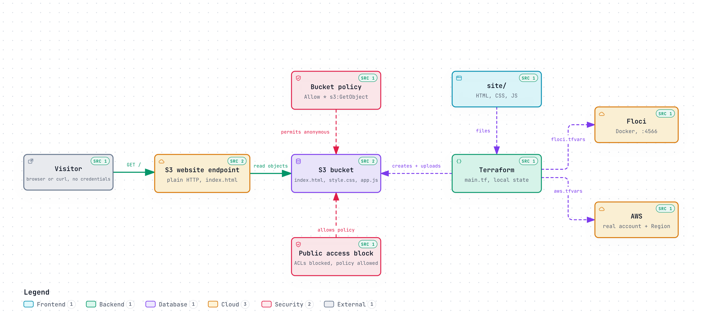

# Spike 0: S3 static website

This is the smallest AWS Primer deployment: one S3 bucket, three static website
files, and the website configuration and read policy needed to serve them to
anonymous visitors. The AWS bucket name includes the intended 12-digit account
ID. The local Floci bucket uses a short fixed name.

The bucket allows public reads of its objects. Anyone who knows the website URL
can fetch the files. The site is plain HTTP, as provided by the S3 website
endpoint, and contains only a harmless demo page.

[](diagrams/architecture-s3-website.html)

Interactive diagrams (download the HTML files to open them locally):
[architecture](diagrams/architecture-s3-website.html),
[anonymous fetch sequence](diagrams/sequence-anonymous-fetch.html),
[end-to-end check workflow](diagrams/workflow-e2e-check.html), and
[site-to-visitor data flow](diagrams/dataflow-site-to-visitor.html).

## Local Floci

From the repository root, run the full local end-to-end check:

```bash
make SPIKE=spike-0 e2e
```

The target starts Floci in Docker, creates the S3 website, and uses unsigned
HTTP requests to fetch the HTML, CSS, and JavaScript. It checks their content
types and expected page content, then leaves the site and Floci running for
inspection. Open the printed website URL in a browser to explore it. Local
Floci state remains under the ignored `data/` directory.

Use `make SPIKE=spike-0 help` to inspect the local targets. Remove the website
stack while leaving Floci running with `make SPIKE=spike-0 destroy`; stop Floci
afterward with `make SPIKE=spike-0 local-down`.

To destroy the local website, stop Floci, and remove its persisted state and
Terraform's downloaded plugins in one step, run
`make SPIKE=spike-0 local-clean`. The Terraform lockfile stays in place, so a
later `terraform init` can reinstall the pinned provider. This leaves AWS state
alone.

## AWS

Copy `aws.tfvars.example` to `aws.tfvars`, set the intended account ID and
Region, then authenticate an AWS CLI profile with permission to create and
delete S3 buckets, website configuration, public access settings, and bucket
policies. From the repository root, run:

```bash
make SPIKE=spike-0 aws-e2e AWS_PROFILE=your-profile
```

The target verifies that the profile belongs to the configured account, applies
the stack, and uses `curl` without AWS credentials to fetch all three website
files. It leaves the public website running for inspection. Remove the bucket
and its objects with:

```bash
make SPIKE=spike-0 aws-destroy AWS_PROFILE=your-profile
```

Some AWS Organizations or account policies prevent public bucket policies. In
that case, AWS rejects the policy or anonymous requests fail, and the E2E
reports failure.
