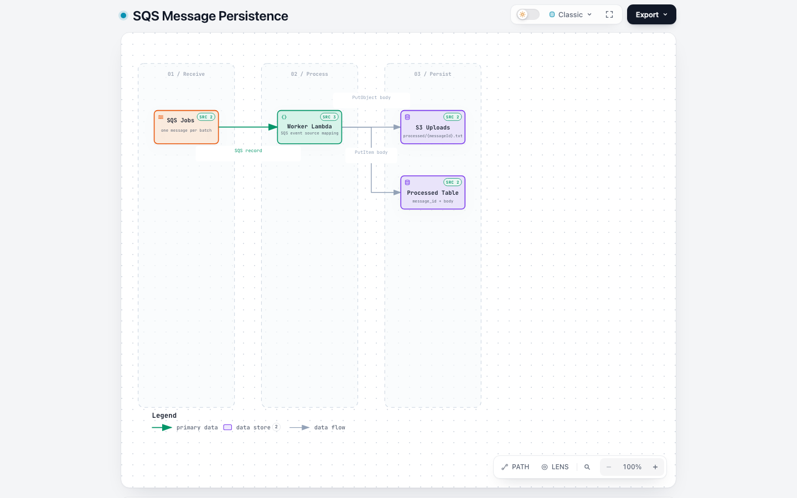

# Spike 1: SQS, Lambda, S3, and DynamoDB

This Terraform spike connects SQS, Lambda, S3, DynamoDB, and IAM. Floci is the
default target and runs in Docker; it is not installed with `uv`. The same
Terraform resources can also target a real AWS account using an explicit AWS
configuration and separate Terraform state.

[Open the interactive data-flow diagram](.archify/dataflow-sqs-persistence-20261001-130013/sqs-message-dataflow.html)
for the SQS-to-Lambda-to-storage path and the worker role's permission scope.

[](.archify/dataflow-sqs-persistence-20261001-130013/sqs-message-dataflow.html)

IAM policy enforcement is enabled here; without that setting, Floci allows
requests regardless of the calling identity's policies. The AWS provider's
`test` credentials are a Floci bypass identity, so this experiment also checks
whether Lambda's execution role is evaluated under enforcement.

## What this spike demonstrates

- **SQS invokes Lambda through an event source mapping.** Lambda polls the
  queue; the handler does not call SQS to receive its event. The mapping uses
  a batch size of one to keep this experiment's message path easy to inspect.
  See [Lambda's SQS event source mapping guide](https://docs.aws.amazon.com/lambda/latest/dg/with-sqs.html).
- **Visibility timeout gives a failed message time before it can be received
  again.** The queue uses 60 seconds for a function with a 10-second timeout,
  matching AWS's recommendation that the visibility timeout be at least six
  times the function timeout ([configuration guidance](https://docs.aws.amazon.com/lambda/latest/dg/services-sqs-configure.html)).
  This is a retry window, not a guarantee that a message is processed only once.
- **SQS event source mappings deliver at least once.** A retry can repeat
  writes. This handler uses the SQS message ID for its S3 key and DynamoDB
  partition key, so repeating this demo write replaces the same records. That
  is a simple demonstration, not a full idempotency strategy for business
  operations ([delivery semantics](https://docs.aws.amazon.com/lambda/latest/dg/with-sqs.html)).
  There is no queue redrive policy or partial batch failure handling in this
  spike; the batch size of one keeps each invocation to one message.
- **IAM permissions are scoped by resource.** The worker can write only below
  the S3 `processed/` prefix and to the named DynamoDB table. Its deliberate
  `s3:ListBucket` permission is absent. The E2E invokes the Lambda separately
  with an IAM probe event and requires the result to be `AccessDenied`; normal
  SQS messages do not run the probe. This exercises the Lambda execution role
  rather than only inspecting the policy document.

The spike also omits customer-managed encryption keys, alarms, and log
retention settings. Those are useful follow-up lessons, not properties this
experiment validates.

The AWS run exercises the same resource graph against AWS. It does not run in
GitHub CI, where Floci is used without account credentials. Terraform state is
stored in local files for this checkout; this is not a shared or locked remote
state setup.

The probe passed with Floci 2.1.0: Terraform created the IAM role and policy,
S3 bucket, SQS queue, DynamoDB table, Lambda, and SQS event source mapping.
Lambda consumed an SQS message and wrote it to S3 and DynamoDB using its
execution role. The role grants `s3:PutObject` only under `processed/` and
`dynamodb:PutItem` only on the test table. With enforcement on, an ungranted
`s3:ListBucket` call was denied as expected. The initial run with enforcement
off allowed that call, as Floci documents.

From the repository root, run the local end-to-end check and cleanup. Spike 1
is selected by default:

```bash
make e2e
```

Use `make SPIKE=spike-2 help` to inspect the second spike's targets.

To inspect the local targets, use `make help`. `make apply` starts Floci,
packages the Lambda, and applies the local stack; `make destroy` removes the
Floci resources and leaves Floci running. `make local-down` stops Floci.
`make local-clean` destroys the local stack, stops Floci, and removes its
persistent data and downloaded Terraform plugins.

For AWS, copy `aws.tfvars.example` to `aws.tfvars`, set the account ID and
Region, authenticate an AWS CLI profile, then use `make aws-plan`,
`make aws-apply`, `make aws-e2e`, and `make aws-destroy`. These targets use a
separate AWS state file and never start Floci. AWS E2E leaves the stack running
so you can inspect it; empty its S3 bucket before running `aws-destroy`.
See the repository's [AWS deployment guide](../../docs/deploy-to-aws.md).

This is an integration probe, not proof of AWS parity. Check the Floci logs for
Lambda invocation output and record any unsupported API or behavioral gap.

Each spike's `terraform.tfvars` sets its local region and Floci endpoint URLs.
Terraform loads that file automatically; the Makefile also reads the host
endpoint and region from it for AWS CLI commands. The Lambda endpoint uses the
Docker service name so runtime containers can reach Floci.

The emulator stores state under `data/`; remove that directory only when you
want to reset this disposable local experiment.
