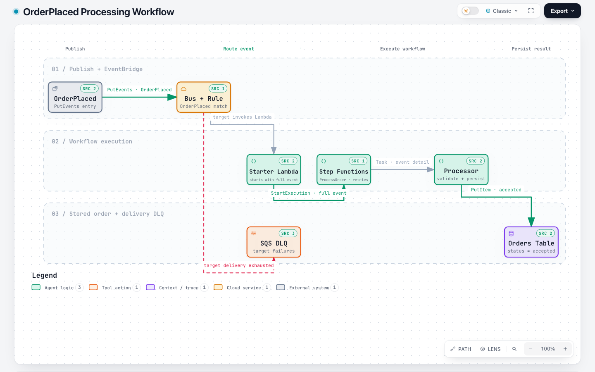

# Spike 2: event driven order workflow

This spike connects EventBridge, Step Functions, Lambda, DynamoDB, IAM, and an
SQS delivery dead-letter queue:

[Open the interactive workflow diagram](.archify/workflow-order-event-20261001-130013/order-event-workflow.html)
for the event path, workflow steps, persistence, and EventBridge delivery DLQ.

[](.archify/workflow-order-event-20261001-130013/order-event-workflow.html)

```text
OrderPlaced event -> EventBridge rule -> starter Lambda -> Step Functions -> processor Lambda -> DynamoDB
                                      \\-> SQS delivery DLQ
```

EventBridge invokes a starter Lambda, which calls `StartExecution` with the
full event. The workflow invokes the processor Lambda with the event detail.
The processor validates the order and stores it with an `accepted` status. The
SQS queue is an EventBridge target delivery DLQ; it does not capture failures
inside a workflow execution.

## Run locally with Floci

From the repository root:

```bash
make SPIKE=spike-2 help
make SPIKE=spike-2 e2e
```

The E2E target applies the local stack, publishes an event, checks the expected
order status and amount in DynamoDB, then destroys the stack and stops Floci.
`floci.tfvars` selects the Floci endpoints and local region. Local Terraform
state is stored in `terraform.tfstate`.

## Deploy to AWS

Copy the example variables and set the account ID:

```bash
cp src/spike-2/aws.tfvars.example src/spike-2/aws.tfvars
```

The file is ignored by Git and must not contain credentials. Authenticate with
the AWS profile to use, then review the plan before applying:

```bash
aws sso login --profile aws-primer
make SPIKE=spike-2 aws-plan AWS_PROFILE=aws-primer
make SPIKE=spike-2 aws-apply AWS_PROFILE=aws-primer
```

Both the Makefile and AWS provider check that the active profile account
matches `aws_account_id`. AWS resource names include the account ID. AWS uses a
separate local state file, `terraform.aws.tfstate`.

Run the AWS E2E check to publish an order and verify its persisted result:

```bash
make SPIKE=spike-2 aws-e2e AWS_PROFILE=aws-primer
```

The check leaves AWS resources running for inspection and AWS usage can incur
charges. The AWS target uses an EventBridge Lambda resource permission, and
scopes the starter role's `states:StartExecution` permission to this state
machine. Floci uses its IAM role integration and wildcard scope because of its
local policy evaluation behavior.

To remove the AWS stack, run:

```bash
make SPIKE=spike-2 aws-destroy AWS_PROFILE=aws-primer
```

Terraform displays the resources and asks for confirmation. Destroying the
stack also deletes the DynamoDB table and any demo orders it contains.

## AWS targets

`aws-send-event` publishes an `OrderPlaced` event. Set `ORDER_ID`; optional
`CUSTOMER_ID` and `AMOUNT_CENTS` default to `demo-customer` and `4200`.
`aws-verify` displays the resulting DynamoDB record for an `ORDER_ID`.

## Emulator limitations

This is an integration probe, not evidence of full AWS parity. Floci 2.1.0
reported `unsupported target ARN type` for direct EventBridge-to-Step-Functions
targets, so this spike routes through a starter Lambda. `PutEvents` can succeed
even when target delivery fails; the E2E check waits for the DynamoDB result.
