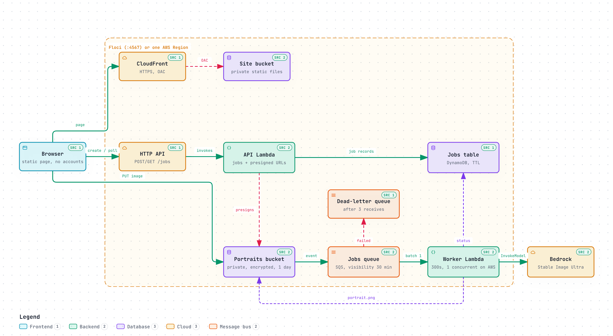

# Spike 3: AI business portrait studio

This spike turns an ordinary photo into a professional business portrait with
Amazon Bedrock's Stability AI Stable Image Ultra image-to-image model. It
includes both a direct model experiment and a small serverless web application.
The web flow accepts a private upload, queues a job, asks Bedrock to transform
the image, and offers a temporary private result link.

This is a learning spike, not a promise of identity preservation or a
production service. Compare the source and generated images; the model can
change facial features, age, clothing, and other details. Use a JPEG or PNG
photo you have permission to process. AWS uploads are sent to Bedrock for
inference.

[](diagrams/architecture-portrait-studio.html)

Interactive diagrams (download the HTML files to open them locally):
[architecture](diagrams/architecture-portrait-studio.html),
[portrait job sequence](diagrams/sequence-portrait-job.html),
[photo-to-portrait data flow](diagrams/dataflow-photo-to-portrait.html), and
[end-to-end check workflow](diagrams/workflow-e2e-check.html).

## First experiment

Install `uv`, AWS CLI v2, and authenticate the `dinu` profile. Stable Image
Ultra is invoked in `us-west-2` by default; override `REGION` if needed. Put a
JPEG or PNG portrait at a local path, then run:

```bash
make SPIKE=spike-3 experiment IMAGE=./portrait.jpg AWS_PROFILE=dinu
```

The script sends the image and prompt directly to Bedrock, then writes the
generated image under the ignored `output/` directory. It does not upload the
source image to S3. The profile needs permission to invoke the selected Bedrock
model, and the account must be able to use it in the chosen Region. Image
inference may incur charges. Tune how strongly the result follows the prompt
with `STRENGTH=0.7` (range 0.0 to 1.0); higher values can change more of the
source image, including the person's appearance.

### Initial result

On 2026-10-04, Stable Image Ultra (`stability.stable-image-ultra-v1:1`) ran
successfully with AWS profile `dinu` in `us-west-2`. At strength `0.35`, the
result stayed close to the original photo and did not change the clothes or
setting much. At `0.75`, it produced a blazer and an indoor business-like
background. The face remained recognizably similar, though some facial details
changed. These are visual observations from one sample, not a general measure
of identity preservation. The generated files are ignored under `output/`.

A second run used the image asset linked from
[thispersondoesnotexist.com](https://thispersondoesnotexist.com/) with the
prompt: “Professional photo headshot of this person in a business suit
standing alone in an elevator looking into the camera.” At strength `0.75`,
the result added an elevator-like background and made the person face the
camera, but the business suit was only weakly visible. The site's root page
currently serves a “Domain For Sale” page; the test used its linked
`random-person.jpeg` asset, so it was one static synthetic portrait rather
than a fresh sample. The downloaded input and generated result stay ignored
locally.

For a repeatable sample, the experiment can download a portrait photograph
from Wikimedia Commons. It is licensed CC BY 3.0; attribution and source are recorded here.
The image is kept locally and ignored by Git:

```bash
make SPIKE=spike-3 fetch-sample
make SPIKE=spike-3 experiment IMAGE=data/portrait.jpg AWS_PROFILE=dinu
```

Sample: [Example of person portrait.jpg](https://commons.wikimedia.org/wiki/File:Example_of_person_portrait.jpg)
by Marin Bobek, [CC BY 3.0](https://creativecommons.org/licenses/by/3.0/).

## Serverless portrait app

The AWS Terraform stack in this directory creates:

- A private S3 bucket for input and generated images, with encryption, browser
  CORS rules, and a lifecycle rule to expire objects after one day.
- An HTTP API and API Lambda to create a job, issue a presigned upload URL, and
  return status plus a five-minute presigned result URL.
- DynamoDB job records with TTL, an S3 upload notification, an SQS queue and
  dead-letter queue, and a worker Lambda with partial-batch retries.
- A worker role scoped to the input and result prefixes and the selected
  Bedrock model; the API role can create/read jobs and sign object URLs.
- A private static S3 website served through CloudFront Origin Access Control.

There are no user accounts. A randomly generated job ID acts as a bearer
reference: anyone who knows it can request that job's status and result URL
until the record expires. The API is public, and the create-job route has a
small throttle. Do not upload sensitive images or use this demo for private
client work. S3 lifecycle expiration and DynamoDB TTL are asynchronous cleanup
mechanisms, so deletion may happen after the configured one-day threshold.
The worker is limited to one concurrent invocation to keep model usage modest;
this can leave jobs waiting in the queue during a burst.

### Local Floci version

The local stack uses port 4567 so it can run beside the other spikes on their
usual Floci port. By default Floci executes the same API and worker handlers,
but the worker copies the input image into the result key instead of calling
an image model. This checks the upload, S3 notification, SQS, Lambda, job
status, and download flow without inference charges. The page runs at
[http://localhost:8080](http://localhost:8080). Floci's AWS API endpoint is
`http://localhost:4567`; API Gateway uses a local hostname such as
`http://<api-id>.execute-api.us-east-1.localhost:4567`. `make serve` reads the
API URL from the local Terraform state automatically and proxies browser API
requests through `localhost:8080`, so the browser does not need to resolve
Floci's API hostname. Presigned S3 uploads still go directly to Floci on port
4567.

```bash
make SPIKE=spike-3 check-all
make SPIKE=spike-3 e2e
```

The E2E target starts Floci, provisions the stack, uploads a tiny test image,
checks that the result matches the test input, then destroys Terraform
resources and stops Floci. Floci's ignored `data/` state remains until
`make SPIKE=spike-3 local-clean` removes it. The `destroy` target empties the
portraits bucket before asking Terraform to delete it, avoiding a slow Floci
`force_destroy` operation when local uploads and results are present. To leave
the local stack running for manual browser testing, use
`make SPIKE=spike-3 apply` followed by
`make SPIKE=spike-3 serve`; remove it with `make SPIKE=spike-3 destroy`.

To make local uploads generate a new image with Bedrock, use the Bedrock mode
instead of the copy stub:

```bash
make SPIKE=spike-3 apply-bedrock AWS_PROFILE=dinu
make SPIKE=spike-3 serve
```

The profile must be authenticated and allowed to invoke the configured model
in `us-west-2` (override `bedrock_region` in `floci.tfvars` to change it).
Uploads in this mode are sent from the local Floci Lambda to Amazon Bedrock and
may incur model charges. The UI identifies whether the running stack uses the
copy stub or Bedrock. Floci sets a global AWS endpoint for its emulated
services, so the worker explicitly targets the regional Bedrock endpoint to
send inference requests to AWS. The worker expects Stable Image Ultra's
`images` response field; an empty result is marked failed without retrying the
model request.

The temporary profile credentials are passed into the local worker and are
stored in Terraform's ignored local state and Floci's ignored `data/`
directory. With expiring credentials, rerun `apply-bedrock` after they expire.
Use `make SPIKE=spike-3 apply` to return to the no-charge copy stub.

To stop local services, stop the page server with Ctrl-C and run:

```bash
make SPIKE=spike-3 local-down
```

This stops Floci and its Lambda runtimes but preserves Terraform state and
Floci data, so no local jobs run while it is stopped. Start again with
`make SPIKE=spike-3 apply` (copy stub) or `apply-bedrock` (real inference),
then `make SPIKE=spike-3 serve`. To destroy local resources and remove Floci
data and provider plugins, run `make SPIKE=spike-3 local-clean` instead.

### AWS deployment

The AWS deployment runs the complete website and processing flow in AWS. A
private S3 bucket stores uploads and generated portraits; an HTTP API and
Lambda create jobs and presigned URLs; S3 sends upload events through SQS to a
worker Lambda; the worker calls Stable Image Ultra in Bedrock; DynamoDB tracks
job status; and a private S3 site bucket serves the UI through CloudFront OAC.
The site and API endpoints are public, but image objects remain private and
are accessed through short-lived presigned URLs.

You need Terraform, AWS CLI v2, and an AWS profile authorized to create the
stack's resources, including IAM roles and policies. The profile must point
at the account you intend to use. If it uses AWS IAM Identity Center, log in
first, for example `aws sso login --profile dinu`. The account must also be
enabled to invoke Stable Image Ultra in the configured Region (`us-west-2` by
default). The AWS Make targets verify the profile's 12-digit account ID
against the value in `aws.tfvars` before they make changes.

Copy the example variables file and replace the account ID:

```bash
cp src/spike-3/aws.tfvars.example src/spike-3/aws.tfvars
```

Set `aws_account_id` in that file to the expected 12-digit account ID. Then
get the ID from the selected profile, set it in the file, review the plan, and
deploy:

```bash
aws --profile dinu sts get-caller-identity --query Account --output text
# Put the returned account ID in aws_account_id in aws.tfvars.
make SPIKE=spike-3 aws-plan AWS_PROFILE=dinu
make SPIKE=spike-3 aws-apply AWS_PROFILE=dinu
```

Terraform uses a separate local state file, `terraform.aws.tfstate`, for AWS;
keep it private and do not commit it. After the apply completes, get the HTTPS
CloudFront URL and open it in a browser:

```bash
terraform -chdir=src/spike-3 output -raw website_url
```

Choose a JPEG or PNG up to 10 MiB, edit the prompt if needed, and select
**Create portrait**. The browser uploads the image directly to private S3 with
a presigned URL, then polls the API until the worker finishes. The generated
image is displayed and can be downloaded from a five-minute presigned URL.
The source and result objects are configured to expire after one day, and job
records have DynamoDB TTL enabled; these cleanup mechanisms can run later than
the configured expiration. The API is public and has no user accounts. A job
ID is a bearer reference, so anyone who obtains it can retrieve its status and
temporary result URL while the record exists. Do not use this demo for
sensitive or client images.

For a command-line end-to-end run instead of using the browser, provide a local
image:

```bash
make SPIKE=spike-3 aws-e2e AWS_PROFILE=dinu IMAGE=./portrait.jpg
```

This target verifies the profile and account, deploys the stack if needed,
uploads the image, waits for the Bedrock result, and writes the generated PNG
to the ignored `output/` directory. It leaves the AWS stack deployed. Each
image generation invokes Bedrock and may incur model charges; the API, Lambda,
CloudFront, S3, DynamoDB, SQS, and CloudWatch resources may also incur charges
while deployed.

When finished, destroy the AWS stack:

```bash
make SPIKE=spike-3 aws-destroy AWS_PROFILE=dinu
```

The destroy target repeats the profile/account check. The Terraform S3 buckets
use `force_destroy`, so destroying the stack also deletes the images and site
objects in those buckets. Download any result you want to keep first. The
ignored local Terraform state file remains on disk after destroy; keep it
private or remove it once you no longer need the stack state.
